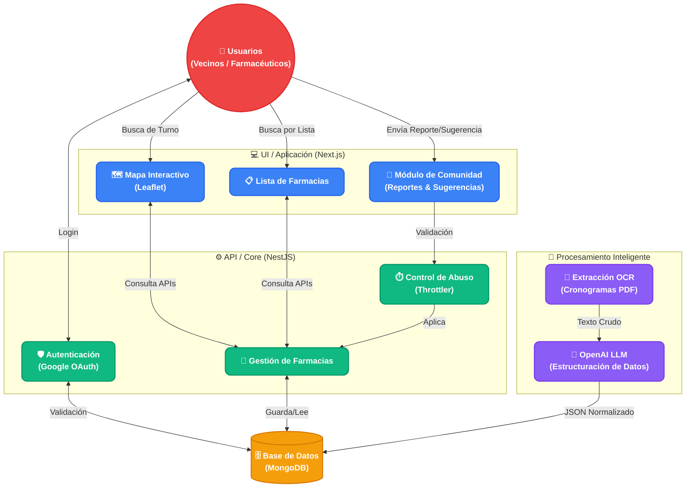

# FarmaYa AR 🏥💊

**FarmaYa AR** es una plataforma moderna y colaborativa para localizar farmacias de turno en Argentina en tiempo real. La aplicación permite a los usuarios encontrar farmacias cercanas a través de un mapa interactivo o una lista detallada, verificar su estado y sugerir nuevas fuentes de información para expandir la cobertura nacional.

## 🏗️ Arquitectura del Proyecto



## 🚀 Características Principales

- **📍 Localizador Inteligente:** Encuentra farmacias de turno cercanas a tu ubicación actual utilizando geolocalización.
- **🗺️ Mapa Interactivo:** Visualización clara mediante pines personalizados que indican el estado de la farmacia (Abierta/Cerrada/Verificada).
- **📋 Lista Detallada:** Vista de lista con información de distancia, dirección y accesos directos para navegación.
- **🚗 Navegación Directa:** Integración con Google Maps para obtener indicaciones instantáneas.
- **🤝 Comunidad FarmaYa:**
  - **Reportar Estado:** Los usuarios pueden confirmar si una farmacia está realmente abierta.
  - **Sugerencias:** Formulario simplificado para proponer nuevas ciudades o fuentes oficiales de datos.
- **🌗 Modo Oscuro/Claro:** Interfaz adaptativa con soporte para temas.
- **📱 Mobile First:** Experiencia optimizada para dispositivos móviles con navegación intuitiva mediante Bottom Sheets.

## 🛠️ Tech Stack

- **Framework:** [Next.js 16 (App Router)](https://nextjs.org/)
- **Lenguaje:** TypeScript
- **Estilos:** Tailwind CSS
- **Componentes UI:** Radix UI / Shadcn UI
- **Mapas:** Leaflet / React Leaflet
- **Data Fetching:** TanStack Query (React Query)
- **Iconos:** Lucide React
- **Estado/Formularios:** React Hook Form + Zod

## 📦 Instalación y Configuración

1. **Clonar el repositorio:**
   ```bash
   git clone https://github.com/duiliomamani/ar.farmacias-ui.git
   cd ar.farmacias-ui
   ```

2. **Instalar dependencias:**
   ```bash
   npm install
   # o
   pnpm install
   ```

3. **Configurar variables de entorno:**
   Crea un archivo `.env.local` basado en `.env.example`:
   ```env
   NEXT_PUBLIC_API_URL=http://localhost:3000
   ```

4. **Iniciar el servidor de desarrollo:**
   ```bash
   npm run dev
   ```

## 📂 Estructura del Proyecto

- `app/`: Rutas y páginas de la aplicación (Next.js App Router).
- `components/`: Componentes modulares y reutilizables.
  - `pharmacy/`: Lógica específica de farmacias (Mapas, Listas, Modales).
  - `ui/`: Componentes de interfaz base (Botones, Inputs, etc.).
- `lib/`: Servicios de API, utilidades y definiciones de datos.
- `hooks/`: Hooks personalizados para lógica de UI y estado.
- `styles/`: Configuraciones globales de CSS.

## 📄 Reglas del Proyecto

El proyecto sigue una estructura y reglas específicas para agentes de IA, las cuales pueden consultarse en el directorio `.agentic-rules/`:
- `frontend-structure.md`: Guía de arquitectura.
- `frontend-router.md`: Convenciones de ruteo.
- `frontend-design.md`: Guía de estilo y UI.

## 🤝 Contribuciones

Las sugerencias son siempre bienvenidas. Puedes utilizar el botón de **Sugerencias** dentro de la app para proponer mejoras o reportar datos faltantes en tu localidad.

---
Desarrollado con ❤️ para ayudar a los argentinos a encontrar salud cuando más la necesitan.
